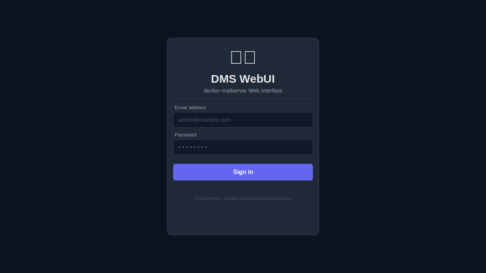
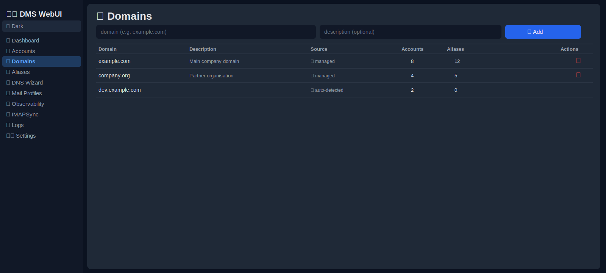
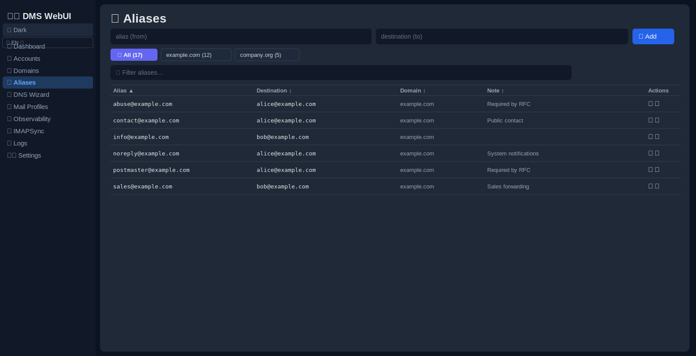
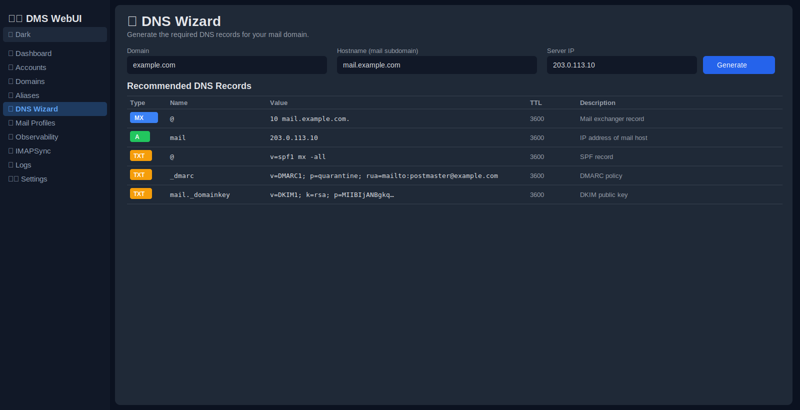
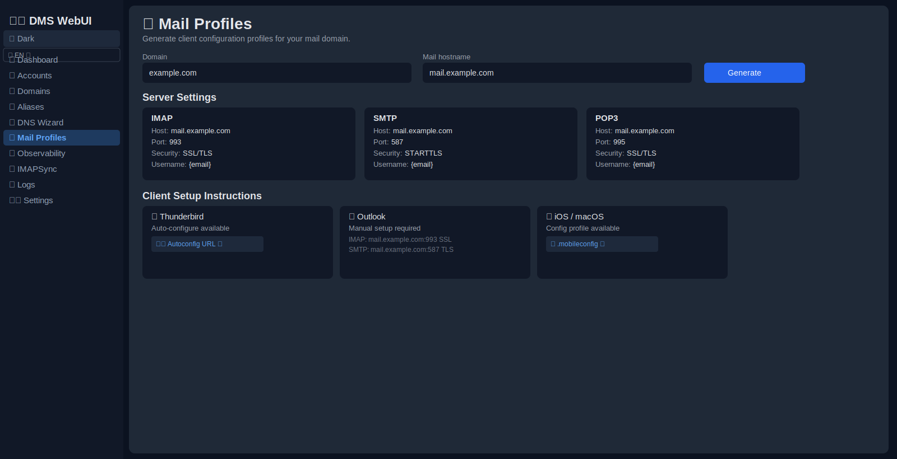
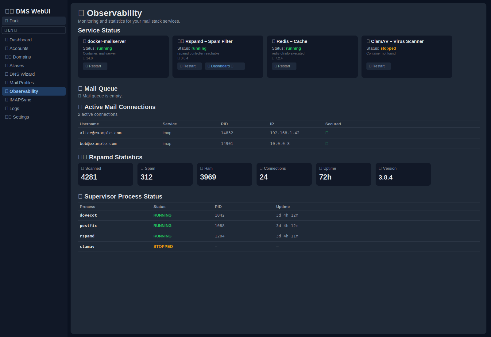
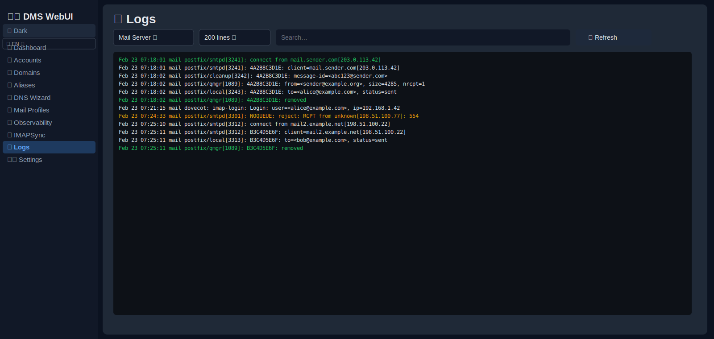
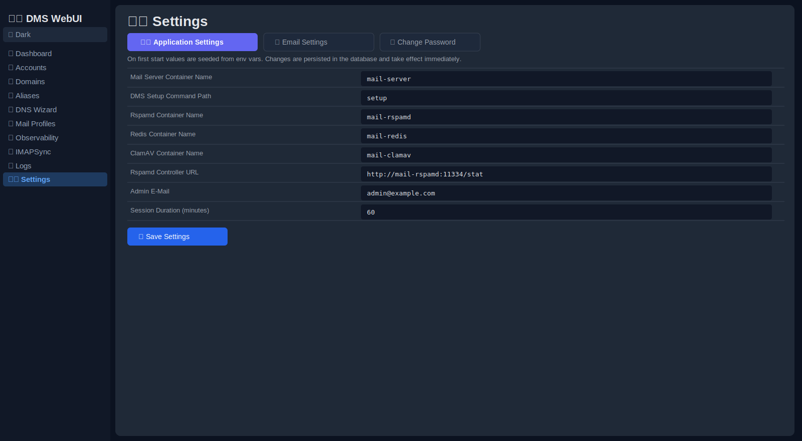

# Docker Mailserver WebUI

> Moderne, sichere und produktionsreife Web-Oberfläche zur Verwaltung von [Docker Mailserver](https://github.com/docker-mailserver/docker-mailserver).

[](https://www.docker.com/)
[](https://fastapi.tiangolo.com/)
[](https://react.dev/)

---

## Inhaltsverzeichnis

1. [Überblick](#überblick)
2. [Architektur](#architektur)
3. [Schnellstart](#schnellstart)
4. [Konfiguration](#konfiguration)
5. [Seiten & Funktionen](#seiten--funktionen)
   - [Dashboard](#dashboard)
   - [Accounts](#accounts)
   - [Domains](#domains)
   - [Aliases](#aliases)
   - [DNS-Assistent](#dns-assistent)
   - [Mail-Profile](#mail-profile)
   - [Observability](#observability)
   - [IMAPSync](#imapsync)
   - [Logs](#logs)
   - [Einstellungen](#einstellungen)
6. [API-Referenz](#api-referenz)
7. [Sicherheit](#sicherheit)
8. [Produktionshinweise](#produktionshinweise)
9. [Build & Veröffentlichung](#build--veröffentlichung)

---

## Überblick

Docker Mailserver WebUI ist eine selbst gehostete Administrationsoberfläche für [Docker Mailserver](https://github.com/docker-mailserver/docker-mailserver). Sie kapselt das offizielle `setup`-CLI in einer übersichtlichen Browser-UI und bietet erstklassige Unterstützung für IMAPSync-Job-Orchestrierung, DNS-Record-Generierung, Mail-Client-Profilbereitstellung und Echtzeit-Observability des gesamten Mail-Stacks.

Die Oberfläche ist vollständig zweisprachig (🇬🇧 Englisch / 🇩🇪 Deutsch). Die Sprache wird beim ersten Aufruf automatisch aus dem Browser ermittelt und kann jederzeit über den 🌐-Selektor in der Seitenleiste gewechselt werden.



---

## Architektur

| Schicht | Technologie |
|---------|-------------|
| **Container-Runtime** | Ein einzelner Container (`webui`) — Backend + Frontend gebündelt |
| **Backend** | FastAPI · SQLAlchemy · APScheduler |
| **Frontend** | React · Vite · ausgeliefert über Nginx |
| **Datenbank** | SQLite (Standard, eingebettet) · PostgreSQL (optional, via Compose-Profil) |
| **Mail-Stack-Integrationen** | docker-mailserver · Rspamd · Redis · ClamAV |

Der WebUI-Container kommuniziert mit docker-mailserver über `docker exec`-Befehle gegen benannte Container und liest/schreibt `mailserver.env` direkt aus einem eingebundenen Pfad. Innerhalb des Mailserver-Containers ist kein zusätzlicher Agent erforderlich.

---

## Schnellstart

### SQLite (ein einzelner Container — empfohlen für den Einstieg)

```bash
cp .env.example .env
# Öffne .env und setze mindestens:
#   SECRET_KEY=<langer-zufälliger-string>
#   ADMIN_EMAIL=du@example.com
#   ADMIN_PASSWORD=<starkes-passwort>
#   DMS_CONTAINER_NAME=<name-des-mailserver-containers>
docker compose up -d
```

- **UI:** `http://localhost:8080`
- **Health-Check:** `http://localhost:8080/health`

### Optionaler PostgreSQL-Container

Für einen dedizierten Datenbank-Container das `postgres`-Compose-Profil aktivieren:

```bash
# In .env:
DATABASE_URL=postgresql+psycopg://dmswebui:dmswebui@db:5432/dmswebui

docker compose --profile postgres up -d
```

### Integration in einen bestehenden Mail-Stack

Den WebUI auf die Container-Namen des vorhandenen Stacks zeigen lassen:

```env
DMS_CONTAINER_NAME=mail-server
RSPAMD_CONTAINER_NAME=mail-rspamd
REDIS_CONTAINER_NAME=mail-redis
CLAMAV_CONTAINER_NAME=mail-clamav
RSPAMD_CONTROLLER_URL=http://mail-rspamd:11334/stat
STACK_BASE_PATH=/srv/apps/mailserver
```

Falls der Rspamd-Controller passwortgeschützt ist:

```env
RSPAMD_CONTROLLER_PASSWORD=<dein_controller_passwort>
```

Falls `mailserver.env` an einem nicht standardmäßigen Pfad liegt (und in den WebUI-Container eingebunden ist):

```env
MAILSERVER_ENV_PATH=/config/mailserver.env
```

---

## Konfiguration

`.env.example` nach `.env` kopieren und die Werte vor dem Start des Containers anpassen:

```bash
cp .env.example .env
```

| Variable | Standard | Beschreibung |
|----------|---------|--------------|
| `DATABASE_URL` | `sqlite:///./data/webui.db` | SQLite (Standard) oder PostgreSQL-Verbindungsstring |
| `SECRET_KEY` | — | **Pflichtfeld.** Langer zufälliger String für die JWT-Signierung |
| `ENCRYPTION_KEY` | — | Fernet-Schlüssel zur Verschlüsselung von IMAPSync-Zugangsdaten (wird bei Leerfeld automatisch generiert) |
| `ADMIN_EMAIL` | `admin@example.com` | E-Mail-Adresse des initialen Admin-Kontos |
| `ADMIN_PASSWORD` | `ChangeMe123!` | Passwort des initialen Admin-Kontos — **beim ersten Login ändern** |
| `DMS_CONTAINER_NAME` | `mail-server` | Name des docker-mailserver-Containers |
| `CORS_ORIGINS` | `http://localhost:8080` | Kommagetrennte Liste erlaubter CORS-Ursprünge |
| `RSPAMD_CONTAINER_NAME` | `mail-rspamd` | Name des Rspamd-Containers |
| `REDIS_CONTAINER_NAME` | `mail-redis` | Name des Redis-Containers |
| `CLAMAV_CONTAINER_NAME` | `mail-clamav` | Name des ClamAV-Containers |
| `RSPAMD_CONTROLLER_URL` | `http://mail-rspamd:11334/stat` | Vollständige URL des Rspamd-Controller-Statistik-Endpunkts |
| `RSPAMD_CONTROLLER_PASSWORD` | — | Optionales Passwort für den Rspamd-Controller |
| `RSPAMD_WEB_HOST` | `mail-rspamd:11334` | Rspamd-Web-Host für den Dashboard-Link |
| `STACK_BASE_PATH` | `/srv/apps/mailserver` | Absoluter Pfad zum Mail-Stack-Verzeichnis auf dem Host |
| `MAILSERVER_ENV_PATH` | `${STACK_BASE_PATH}/mailserver.env` | Pfad zu `mailserver.env` (muss in den WebUI-Container eingebunden sein) |

> Alle Einstellungen außer `SECRET_KEY` und `ENCRYPTION_KEY` können auch zur Laufzeit über **Einstellungen → Anwendungseinstellungen** geändert werden — ohne Neustart des Containers.

---

## Seiten & Funktionen

### Dashboard

Das Dashboard ist die erste Seite nach dem Einloggen. Es bietet einen Überblick über den Zustand und die Aktivität des gesamten Mail-Stacks.

**Was du siehst:**

- **Zusammenfassungskarten** — Gesamtanzahl der Domains, Mail-Accounts, Aliases und aktiver IMAPSync-Jobs.
- **Systemzustandsanzeige** — ein aggregierter Status, der rot wird, sobald ein überwachter Dienst ungesund ist.
- **Dienststatuskarten** — individueller Status und Versionsinformation für docker-mailserver, Rspamd, Redis und ClamAV. Bei Verwendung des Tags `latest` wird die Version aus den Container-Image-Labels aufgelöst.
- **Neustart-Buttons** — jede Dienstkarte verfügt über einen ↺ Neustart-Button, um den jeweiligen Dienst direkt aus dem Browser neu zu starten.
- **Letzter IMAPSync-Status** — eine Kurzübersicht des zuletzt ausgeführten Sync-Jobs.

**Verwendung:**

1. WebUI öffnen — das Dashboard lädt automatisch.
2. Das **Systemzustands**-Badge oben prüfen. Grün bedeutet, alle Dienste laufen.
3. Falls ein Dienst als gestoppt oder ungesund angezeigt wird, auf den **Neustart**-Button klicken.
4. Die Zusammenfassungskarten als schnellen Plausibilitätscheck nach Massenänderungen an Accounts oder Aliases nutzen.


---

### Accounts

Die Accounts-Seite ermöglicht das Erstellen und Verwalten aller Mail-Accounts über alle Domains hinweg.

**Was du tun kannst:**

- **Erstellen** eines neuen Mail-Accounts durch Eingabe von E-Mail-Adresse, Passwort und optionalem Quota.
- **Löschen** eines Accounts — die Aktion wird vor der Ausführung bestätigt.
- **Passwort ändern** für jeden bestehenden Account ohne Kenntnis des aktuellen Passworts.
- **Quota setzen** — Wert in Megabyte eingeben; der Quota-Balken in der Account-Zeile aktualisiert sich sofort.
  - Der Quota-Balken ist farbkodiert: grün unter 70 %, amber von 70–89 %, rot ab 90 %.
  - Der Balken zeigt genutzten Speicher, konfiguriertes Limit und Prozentsatz auf einen Blick.
- **Notizen hinzufügen** — einen Freitext-Kommentar an jeden Account anhängen (z. B. „IT-Abteilung Shared Mailbox"). Notizen werden in der WebUI-Datenbank gespeichert und nie in den Mailserver geschrieben.
- **Alias-Anzahl anzeigen** — jede Zeile zeigt, wie viele Aliases auf den Account verweisen.

**Navigation in der Tabelle:**

- Die **Domain-Tabs** (je einer pro Domain + „Alle") nutzen, um die Ansicht auf eine einzelne Domain einzuschränken. Beim aktiven Domain-Tab wird die redundante Domain-Spalte automatisch ausgeblendet.
- Im **Live-Filter**-Feld tippen, um sofort nach E-Mail-Adresse, Domain und Notiz zu suchen.
- Auf eine **Spaltenüberschrift** klicken, um die Tabelle aufsteigend oder absteigend (▲/▼) nach E-Mail, Domain, Quota %, Alias-Anzahl oder Notiz zu sortieren.

**Einen Account erstellen:**

1. Zu **Accounts** in der Seitenleiste navigieren.
2. Auf **Account hinzufügen** klicken.
3. Die vollständige E-Mail-Adresse (z. B. `alice@example.com`), ein Passwort und ein optionales Quota in MB eingeben.
4. Auf **Speichern** klicken. Der Account erscheint sofort in der Tabelle.


---

### Domains

Die Domains-Seite gibt einen Überblick über alle dem Mail-Stack bekannten Domains und ermöglicht die Verwaltung, welche davon explizit im WebUI registriert sind.

**Was du siehst:**

- Jede Domain wird mit ihrer **Account-Anzahl**, **Alias-Anzahl** und einem **Quell-Label** aufgelistet:
  - 🗃 **Verwaltet** — explizit über das WebUI hinzugefügt.
  - 📬 **Automatisch erkannt** — aus bestehenden Mail-Accounts abgeleitet, aber noch nicht explizit verwaltet.
- Ein optionales **Beschreibungsfeld** pro verwalteter Domain (z. B. „Primäre Unternehmens-Domain").

**Eine Domain hinzufügen:**

1. Zu **Domains** in der Seitenleiste navigieren.
2. Auf **Domain hinzufügen** klicken.
3. Den Domain-Namen (z. B. `example.com`) und eine optionale Beschreibung eingeben.
4. Auf **Speichern** klicken. Die Domain erscheint nun als *Verwaltet* und ist im DNS-Assistenten und in Mail-Profilen verfügbar.

**Eine Domain entfernen:**

1. Auf das Papierkorb-Symbol in der Domain-Zeile klicken.
2. Den Löschvorgang bestätigen. Hinweis: Das Entfernen einer Domain aus dem WebUI **löscht keine** zugehörigen Accounts — es entfernt nur die explizite Registrierung.



---

### Aliases

Die Aliases-Seite ermöglicht das Erstellen und Verwalten von E-Mail-Aliases — Adressen, die E-Mails an einen oder mehrere echte Accounts weiterleiten.

**Was du tun kannst:**

- **Erstellen** eines Alias durch Angabe der Alias-Adresse und der Zieladresse.
- **Löschen** eines Alias mit einem Klick (mit Bestätigung).
- **Notizen hinzufügen** — einen Freitext-Kommentar an jeden Alias anhängen (z. B. „Weiterleitung an Vertriebsteam"). Notizen werden in der WebUI-Datenbank gespeichert.

**Navigation in der Tabelle:**

- Die **Domain-Tabs** nutzen, um Aliases nach Domain zu filtern.
- Den **Live-Filter** nutzen, um nach Alias-Adresse, Zieladresse, Domain und Notiz zu suchen.
- Auf eine **Spaltenüberschrift** klicken, um nach Alias, Ziel, Domain oder Notiz zu sortieren.

**Einen Alias erstellen:**

1. Zu **Aliases** in der Seitenleiste navigieren.
2. Auf **Alias hinzufügen** klicken.
3. Die Alias-Adresse (z. B. `info@example.com`) und die Zieladresse (z. B. `alice@example.com`) eingeben.
4. Optional eine Notiz hinzufügen.
5. Auf **Speichern** klicken.



---

### DNS-Assistent

Der DNS-Assistent generiert die empfohlenen DNS-Records für jede verwaltete Domain — bereit zum Kopieren in die DNS-Verwaltungsoberfläche des Providers.

**Generierte Records:**

| Typ | Zweck |
|-----|-------|
| `MX` | Leitet eingehende E-Mails an den Server weiter |
| `A` | Verweist den Mail-Hostnamen auf die Server-IP |
| `SPF` | Autorisiert den Server zum Versand von E-Mails für die Domain |
| `DMARC` | Richtlinie für den Umgang mit nicht authentifizierten E-Mails |
| `DKIM` | Kryptografischer Signaturschlüssel, der in DNS veröffentlicht wird |

**Verwendung:**

1. Zu **DNS-Assistent** in der Seitenleiste navigieren.
2. Den Domain-Tab auswählen, den du konfigurieren möchtest.
3. Jeden Record prüfen — der Assistent zeigt den genauen **Namen**, **Typ** und **Wert** des Records an, der beim DNS-Provider einzutragen ist.
4. Auf das **Kopiersymbol** neben einem Wert klicken, um ihn in die Zwischenablage zu kopieren.
5. Jeden Record in die DNS-Verwaltungsoberfläche des Providers einfügen.

> DKIM-Records werden direkt aus der docker-mailserver-Konfiguration gelesen. Stelle sicher, dass die DKIM-Schlüssel bereits generiert wurden (`setup config dkim`), bevor du den DNS-Assistenten öffnest.



---

### Mail-Profile

Die Seite Mail-Profile generiert gebrauchsfertige Mail-Client-Konfigurationsinformationen für Endbenutzer. Anstatt manuelle Einrichtungsanleitungen zu versenden, können Nutzer auf diese Seite verwiesen oder die Konfiguration direkt exportiert werden.

**Was bereitgestellt wird:**

- **IMAP / POP3 / SMTP-Einstellungen** — Server-Hostname, Port, Verschlüsselungstyp und Authentifizierungsmethode für jedes Protokoll.
- **Autoconfig-URL** — eine Thunderbird-kompatible Autodiscovery-URL, die Nutzer in den Konto-Einrichtungsassistenten von Mozilla Thunderbird einfügen können.
- **`.mobileconfig`-Download** — ein Apple-Konfigurationsprofil für die automatische Einrichtung auf iOS- und macOS-Geräten. Auf **Download** klicken und die Datei auf dem Gerät öffnen.
- **Manuelle Einrichtungshinweise** — Schritt-für-Schritt-Anleitungen für Outlook (Windows/Mac) und Android-Mail-Clients.

**Verwendung:**

1. Zu **Mail-Profile** in der Seitenleiste navigieren.
2. Den Domain-Tab für die zu konfigurierende Domain auswählen.
3. Die IMAP/SMTP-Einstellungen mit Nutzern teilen oder ihnen die Autoconfig-URL senden.
4. Für mobile Nutzer die `.mobileconfig`-Datei herunterladen und per E-Mail oder MDM-System versenden.



---

### Observability

Die Observability-Seite bietet tiefe Betriebseinblicke in alle Komponenten des Mail-Stacks von einem einzigen Bildschirm aus.

**Abschnitte auf dieser Seite:**

- **Dienststatus & Neustart** — Echtzeit-Status und ↺ Neustart-Buttons für docker-mailserver, Rspamd, Redis und ClamAV.
- **Mail-Warteschlange** — die Live-Postfix-Queue. Jeder Eintrag zeigt Queue-ID, Nachrichtengröße, Eingangsdatum, Absender und Empfänger. Nützlich zum Aufspüren feststeckender Nachrichten.
- **Aktive Mail-Verbindungen** — Live-Dovecot-Sessions via `doveadm who`. Spalten umfassen Benutzername, Dienst (IMAP/POP3), PID, Remote-IP und TLS-Status.
- **Rspamd-Statistiken** — Anzahl gescannter Nachrichten, Spam-/Ham-Gesamtwerte, aktive Verbindungen, Uptime, Version und eine vollständige Aufschlüsselung der ergriffenen Maßnahmen (reject, soft-reject, rewrite, add header, no action).
- **Supervisor-Prozessstatus** — alle von Supervisord im docker-mailserver-Container verwalteten Prozesse: Name, Status (RUNNING / STOPPED), PID und Uptime.

**Verwendung:**

1. Zu **Observability** in der Seitenleiste navigieren.
2. Die **Dienststatus**-Karten oben prüfen. Falls ein Dienst gestoppt ist, auf **Neustart** klicken.
3. Zur **Mail-Warteschlange** scrollen, um auf feststeckende oder zurückgewiesene Nachrichten zu prüfen.
4. **Aktive Verbindungen** prüfen, um zu sehen, wer gerade eingeloggt ist.
5. Die **Rspamd-Statistiken** prüfen, um zu verifizieren, dass die Spam-Filterung funktioniert, und die Aktionsverteilung zu überprüfen.



---

### IMAPSync

Die IMAPSync-Seite ermöglicht das Definieren, Verwalten und Überwachen von Mail-Migrations- und Synchronisations-Jobs zwischen Remote-IMAP-Servern und lokalen Mailboxen.

**Was du tun kannst:**

- **Erstellen** eines Sync-Jobs durch Angabe des Quell-Servers (Host, Port, Benutzer, Passwort, SSL) und einer lokalen Ziel-Mailbox.
- **Bearbeiten** jedes Jobs, um Zugangsdaten, Zeitplan oder Verbindungsparameter zu aktualisieren.
- **Löschen** eines Jobs dauerhaft.
- **Aktivieren / Deaktivieren** von Jobs — deaktivierte Jobs werden vom Scheduler übersprungen.
- **Überwachen** des letzten Status und des letzten Ausführungszeitstempels jedes Jobs auf einen Blick.

**Lokaler Account-Selektor:**

Beim Erstellen eines Jobs füllt die Auswahl einer lokalen Mailbox aus dem Dropdown automatisch den Ziel-Host als `mail.<domain>` (editierbar) aus und befüllt den Ziel-Benutzernamen. **Custom** wählen für eine vollständig manuelle Ziel-Eingabe beim Synchronisieren zwischen zwei externen Servern.

**Sicherheit:**

Alle Quell- und Ziel-Passwörter werden mit Fernet-symmetrischer Verschlüsselung verschlüsselt gespeichert. Der `ENCRYPTION_KEY` in `.env` schützt die Zugangsdaten.

**Einen Sync-Job erstellen:**

1. Zu **IMAPSync** in der Seitenleiste navigieren.
2. Auf **Job hinzufügen** klicken.
3. Die Quell-Server-Details eingeben (Host, Port, Benutzername, Passwort, SSL-Umschalter).
4. Eine lokale Ziel-Mailbox aus dem Dropdown auswählen (oder **Custom** wählen und Details manuell eingeben).
5. Das Sync-Intervall festlegen und den Job optional sofort aktivieren.
6. Auf **Speichern** klicken. Der Job erscheint in der Tabelle mit seinem aktuellen Status.


---

### Logs

Die Log-Viewer-Seite bietet direkten Zugriff auf die neueste Log-Ausgabe der Schlüsselkomponenten des Mail-Stacks — ohne Shell-Zugriff auf den Server.

**Was du tun kannst:**

- **Log-Quelle auswählen:**
  - `mailserver` — das docker-mailserver-Container-Log (erfordert, dass `/var/log/mail.log` in den WebUI-Container eingebunden ist).
  - `imapsync` — das IMAPSync-Container- oder Job-Log.
  - `webui` — das WebUI-Backend-Anwendungslog.
- **Zeilenanzahl konfigurieren** — wählen, wie viele der neuesten Zeilen abgerufen werden sollen: 100, 200, 500 oder 1000.
- **Filtern** der angezeigten Ausgabe durch Eingabe eines Suchbegriffs im Filterfeld — nur übereinstimmende Zeilen werden angezeigt.
- **Manuell aktualisieren** durch Klicken des Aktualisieren-Buttons, um die neueste Ausgabe abzurufen.

**Verwendung:**

1. Zu **Logs** in der Seitenleiste navigieren.
2. Die **Quelle** aus dem Dropdown auswählen.
3. Die **Zeilenanzahl** bei Bedarf anpassen.
4. Einen Suchbegriff im **Filter**-Feld eingeben, um die Ausgabe einzugrenzen (z. B. `NOQUEUE`, `reject`, `alice@`).
5. Auf **Aktualisieren** klicken, um das Log jederzeit neu zu laden.



---

### Einstellungen

Die Einstellungsseite ist in drei Tabs unterteilt, die die Konfiguration des WebUI selbst, des zugrundeliegenden Mail-Stacks und des Administrator-Kontos ermöglichen.

#### Anwendungseinstellungen

Die Laufzeitparameter des WebUI konfigurieren. Änderungen werden in der Datenbank gespeichert und bei der nächsten Anfrage angewendet — kein Container-Neustart erforderlich.

- **Container-Namen** — die Namen der docker-mailserver-, Rspamd-, Redis- und ClamAV-Container an den eigenen Stack anpassen.
- **Stack-Basispfad** und **mailserver.env-Pfad** — aktualisieren, wenn das Verzeichnis-Layout vom Standard abweicht.
- **Rspamd-Controller-URL und Passwort** — Verbindung zu einer Rspamd-Instanz mit benutzerdefinierter Adresse oder Zugangskontrolle herstellen.
- **Session-Dauer** — wie lange eine Benutzersitzung gültig bleibt (in Minuten).
- **CORS-Ursprünge** — zusätzliche Ursprünge auf die Whitelist setzen, wenn der WebUI von einem anderen Hostnamen aus aufgerufen wird.

#### E-Mail-Einstellungen

Die Felder in `mailserver.env` direkt im Browser bearbeiten, gruppiert nach Kategorie (Allgemein, TLS, Spam, DKIM, …). Dies erfordert, dass `mailserver.env` in den WebUI-Container eingebunden ist. Änderungen werden sofort in die Datei geschrieben und treten nach dem Neuladen von docker-mailserver in Kraft.

#### Passwort ändern

Das WebUI-Administrator-Passwort aktualisieren. Das aktuelle Passwort muss vor dem Setzen eines neuen angegeben werden.

**Anwendungseinstellungen ändern:**

1. Zu **Einstellungen → Anwendungseinstellungen** in der Seitenleiste navigieren.
2. Die relevanten Felder aktualisieren.
3. Auf **Speichern** klicken. Einstellungen werden bei der nächsten API-Anfrage angewendet.



---

## API-Referenz

Alle Endpunkte sind mit `/api` präfixiert und erfordern eine authentifizierte Sitzung.  
Zustandsändernde Anfragen (`POST`, `PUT`, `DELETE`) erfordern zusätzlich den `X-CSRF-Token`-Header, dessen Wert nach dem Login im `csrf_token`-Cookie bereitgestellt wird.

### Authentifizierung

| Methode | Pfad | Beschreibung |
|---------|------|--------------|
| `POST` | `/api/auth/login` | Einloggen — gibt Session-Cookie und CSRF-Token zurück |
| `POST` | `/api/auth/logout` | Ausloggen und Session invalidieren |
| `GET` | `/api/auth/me` | Den aktuell authentifizierten Benutzer zurückgeben |
| `PUT` | `/api/auth/password` | Admin-Passwort ändern |

### Accounts

| Methode | Pfad | Beschreibung |
|---------|------|--------------|
| `GET` | `/api/dms/accounts` | Alle Accounts mit Quota, Alias-Anzahl und Notizen auflisten |
| `POST` | `/api/dms/accounts` | Neuen Account erstellen |
| `DELETE` | `/api/dms/accounts` | Account löschen |
| `PUT` | `/api/dms/accounts/password` | Passwort eines Accounts ändern |
| `PUT` | `/api/dms/accounts/quota` | Quota eines Accounts setzen |
| `PUT` | `/api/dms/accounts/notes` | Account-Notiz speichern oder aktualisieren |

### Aliases

| Methode | Pfad | Beschreibung |
|---------|------|--------------|
| `GET` | `/api/dms/aliases` | Alle Aliases mit Notizen auflisten |
| `POST` | `/api/dms/aliases` | Neuen Alias erstellen |
| `DELETE` | `/api/dms/aliases` | Alias löschen |
| `PUT` | `/api/dms/aliases/notes` | Alias-Notiz speichern oder aktualisieren |

### Domains

| Methode | Pfad | Beschreibung |
|---------|------|--------------|
| `GET` | `/api/dms/domains` | Alle Domains auflisten (verwaltet und automatisch erkannt) |
| `POST` | `/api/dms/domains` | Verwaltete Domain hinzufügen |
| `DELETE` | `/api/dms/domains` | Verwaltete Domain entfernen |

### IMAPSync

| Methode | Pfad | Beschreibung |
|---------|------|--------------|
| `GET` | `/api/imapsync` | Alle Sync-Jobs auflisten |
| `POST` | `/api/imapsync` | Neuen Sync-Job erstellen |
| `PUT` | `/api/imapsync/{id}` | Bestehenden Sync-Job aktualisieren |
| `DELETE` | `/api/imapsync/{id}` | Sync-Job löschen |

### Observability

| Methode | Pfad | Beschreibung |
|---------|------|--------------|
| `GET` | `/api/observability` | Dienststatus und Rspamd-Statistiken |
| `GET` | `/api/supervisorctl` | Supervisor-Prozessliste |
| `GET` | `/api/mailq` | Postfix-Mail-Queue-Einträge |
| `GET` | `/api/doveadm/who` | Aktive Dovecot-Sessions |
| `POST` | `/api/integrations/{service}/restart` | Dienst neu starten (`rspamd`, `redis`, `clamav`) |

### Sonstiges

| Methode | Pfad | Beschreibung |
|---------|------|--------------|
| `GET` | `/api/dashboard` | Dashboard-Zusammenfassungsstatistiken |
| `GET` | `/api/logs/{type}` | Log-Zeilen — `type` ist `mailserver`, `imapsync` oder `webui`; unterstützt `lines`- und `search`-Query-Parameter |
| `GET` | `/api/settings/` | Anwendungseinstellungen lesen |
| `PUT` | `/api/settings/` | Anwendungseinstellungen speichern |
| `GET` | `/api/settings/dms-env` | `mailserver.env`-Schema und aktuelle Werte lesen |
| `PUT` | `/api/settings/dms-env` | Werte in `mailserver.env` schreiben |
| `GET` | `/api/dns-wizard` | DNS-Records für eine Domain generieren |
| `GET` | `/api/mail-profile` | Mail-Client-Profildaten generieren |

---

## Sicherheit

Der WebUI verfolgt einen Defense-in-Depth-Ansatz:

- **Session-Cookies** — `HttpOnly`, `Secure`, `SameSite=Strict`. Sessions werden JavaScript nie zugänglich gemacht.
- **Passwort-Hashing** — Argon2id über [passlib](https://passlib.readthedocs.io/).
- **CSRF-Schutz** — Double-Submit-Cookie-Strategie. Alle mutierenden API-Aufrufe erfordern den `X-CSRF-Token`-Header.
- **Eingabevalidierung** — alle Request-Payloads werden von Pydantic-Modellen validiert, bevor sie die Business-Logik erreichen.
- **Subprocess-Sicherheit** — Docker-CLI-Aufrufe werden als Argumentlisten ohne Shell-Interpolation konstruiert, was Shell-Injection ausschließt.
- **Verschlüsselte Zugangsdaten** — IMAPSync-Quell-/Ziel-Passwörter werden mit Fernet unter Verwendung des `ENCRYPTION_KEY` verschlüsselt gespeichert.

---

## Produktionshinweise

Diese Richtlinien bei der Bereitstellung des WebUI in einer Produktionsumgebung beachten:

- **Starken `SECRET_KEY` generieren**: `openssl rand -hex 32`
- **`ADMIN_PASSWORD` sofort nach dem ersten Login ändern.**
- **TLS-Terminierung** — einen Reverse-Proxy (Nginx, Caddy, Traefik) vor dem WebUI-Container betreiben; Port 8080 nicht direkt ins Internet exponieren.
- **Docker-Socket** — der WebUI benötigt Zugriff auf den Docker-Socket für `docker exec`-Befehle. Dies mit einem Socket-Proxy (z. B. [Tecnativa/docker-socket-proxy](https://github.com/Tecnativa/docker-socket-proxy)) einschränken oder einen dedizierten unprivilegierten Benutzer verwenden.
- **Mail-Logs einbinden** — `/var/log/mail.log` vom Host (oder dem Mailserver-Container-Volume) in den WebUI-Container unter demselben Pfad einbinden, um Live-Log-Tailing zu ermöglichen.
- **Datenbank sichern** — die SQLite-Datenbank wird im Docker-Volume `webui_data` gespeichert. Regelmäßig sichern oder auf PostgreSQL für verwaltete Backups wechseln.
- **CORS-Ursprünge** — `CORS_ORIGINS` auf genau die öffentlichen URL(s) setzen, über die auf die UI zugegriffen wird; in der Produktion kein `*` verwenden.

---

## Build & Veröffentlichung

Ein GitHub-Actions-Workflow steht unter `.github/workflows/publish-ghcr.yml` zur Verfügung, um ein Multi-Arch-Image zu bauen und es in die GitHub Container Registry zu pushen.

**Auslösen:**  
Im Repository unter **Actions → Publish Docker image to GHCR → Run workflow** gehen.

**Erstellte Images:**

```
ghcr.io/<owner>/<repo>:latest
ghcr.io/<owner>/<repo>:sha-<commit-sha>
```

**Das veröffentlichte Image in `docker-compose.yml` verwenden:**

```env
WEBUI_IMAGE=ghcr.io/<owner>/<repo>:latest
```

Lokaler Build:

```bash
docker build -t docker-mailserver-webui:local .
```
