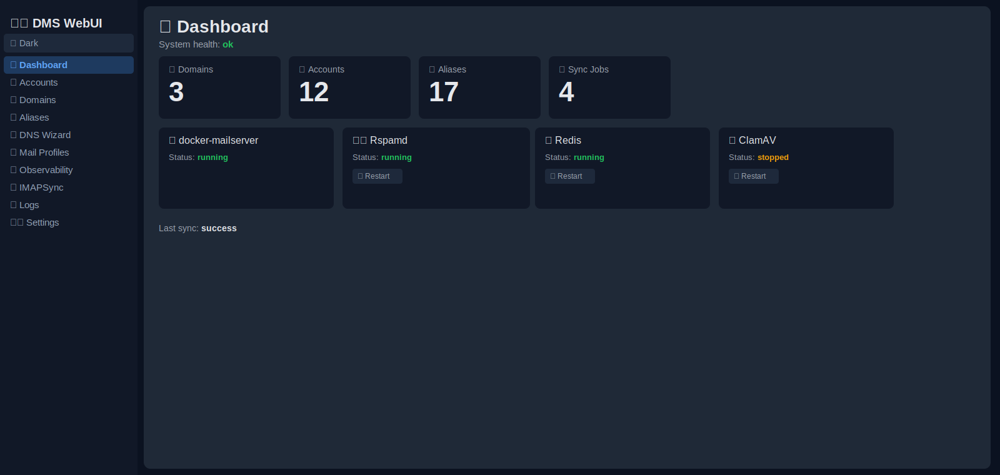
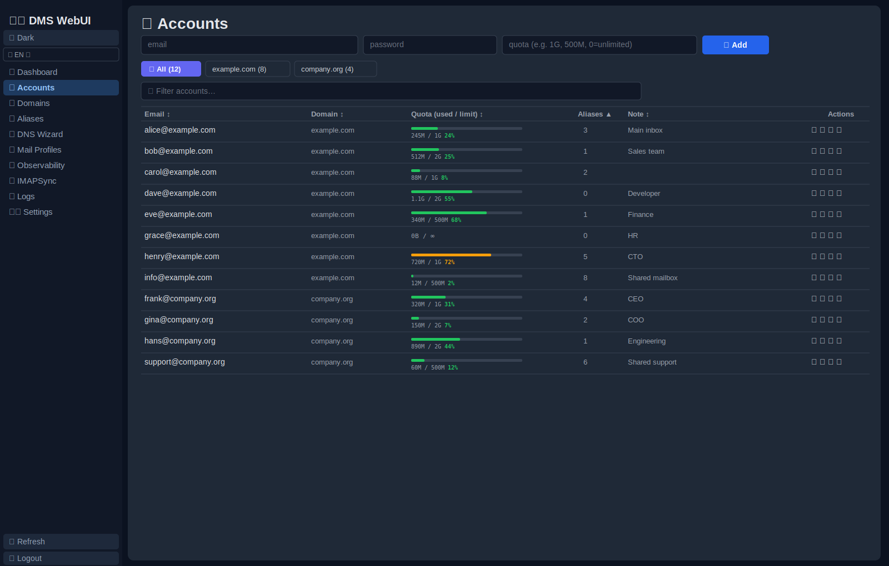
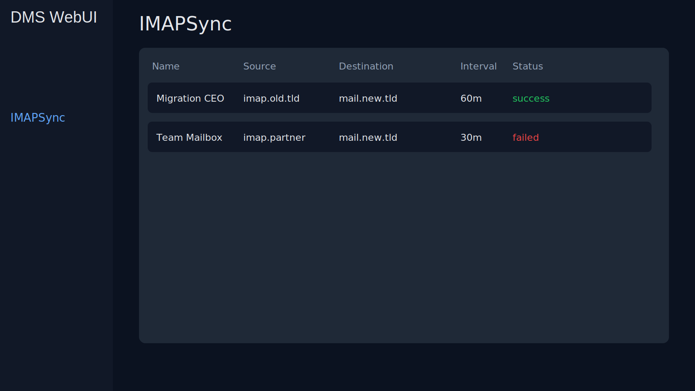

# Docker Mailserver WebUI

Modern, secure, production-oriented WebUI for administrating [Docker Mailserver](https://github.com/docker-mailserver/docker-mailserver) through the official `setup` CLI and IMAPSync orchestration.

## Architecture

- **Single container runtime (default)**: frontend + backend in one container (`webui`)
- **Backend**: FastAPI + SQLAlchemy + APScheduler
- **Frontend**: React + Vite (served by Nginx)
- **DB**:
  - Default: **SQLite inside the webui container**
  - Optional: **PostgreSQL in a dedicated container** via Compose profile
- **Extended mail-security integrations**: rspamd + redis + clamav status/admin hooks

## Features

### Docker Mailserver Administration

- Account lifecycle:
  - Create: `setup email add`
  - Delete: `setup email del`
  - Password update: `setup email update`
  - List accounts: `setup email list`
- Alias lifecycle:
  - Create: `setup alias add`
  - Delete: `setup alias del`
  - List aliases: `setup alias list`
- Multi-domain support through account/domain derivation

### IMAPSync Management

- CRUD IMAPSync jobs
- WebUI stores and manages IMAPSync job definitions only
- Execution is done by your external IMAPSync container/automation
- Enable/disable jobs
- Sync interval is stored as job metadata for your external runner
- Encrypted credentials at rest (Fernet)

### Security Stack Integration (rspamd / redis / clamav)

- Dashboard includes health summary for rspamd, redis, and clamav
- Dedicated UI page for service status and basic restart actions
- Rspamd controller probing (`/stat`) with optional controller password header
- Redis status via `docker exec ... redis-cli INFO`
- ClamAV status via `docker exec ... clamdscan --version`

### Dashboard + Logs

- Dashboard cards for domains, accounts, aliases, active sync jobs, last sync status
- Dashboard system health now also factors in rspamd/redis/clamav status
- Log viewer for mailserver, imapsync, and webui logs
- Search/filter and tail support via API parameters

### Security

- Login/session auth
- Argon2 password hashing
- CSRF protection (double-submit cookie strategy)
- Secure cookies (`httponly`, `secure`, `samesite=strict`)
- Strict input validation (Pydantic)
- Setup command execution with argument-safe subprocess invocation (no shell interpolation)

## API

Key endpoints:

- `POST /api/auth/login`
- `GET /api/dashboard`
- `GET|POST|DELETE /api/dms/accounts`
- `GET|POST|DELETE /api/dms/aliases`
- `GET /api/dms/domains`
- `GET|POST /api/imapsync`
- `PUT|DELETE /api/imapsync/{job_id}`
- `GET /api/integrations/status`
- `POST /api/integrations/{rspamd|redis|clamav}/restart`
- `GET /api/logs/{mailserver|imapsync|webui}`

## Quick Start (SQLite in one container)

```bash
cp .env.example .env
docker compose up -d
```

Open: `http://localhost:8080`
Health: `http://localhost:8080/health`

## Optional PostgreSQL Container

To run Postgres as separate service, set `DATABASE_URL` in `.env` and start the postgres profile:

```bash
# in .env
# DATABASE_URL=postgresql+psycopg://dmswebui:dmswebui@db:5432/dmswebui

docker compose --profile postgres up -d
```


## Build + Publish Image to GHCR (manual workflow)

A GitHub Actions workflow is available at `.github/workflows/publish-ghcr.yml`.

- Trigger: **Actions → Publish Docker image to GHCR → Run workflow**
- Output image: `ghcr.io/<owner>/<repo>:latest` and `ghcr.io/<owner>/<repo>:sha-...`

To use the published image in Compose, set this in your `.env`:

```env
WEBUI_IMAGE=ghcr.io/<owner>/<repo>:latest
```

## Integrating Your Existing Stack (`/srv/apps/mailserver`)

For your setup with container names:
- `mail-server`
- `mail-rspamd`
- `mail-redis`
- `mail-clamav`

set (or keep defaults):

```env
DMS_CONTAINER_NAME=mail-server
RSPAMD_CONTAINER_NAME=mail-rspamd
REDIS_CONTAINER_NAME=mail-redis
CLAMAV_CONTAINER_NAME=mail-clamav
RSPAMD_CONTROLLER_URL=http://mail-rspamd:11334/stat
STACK_BASE_PATH=/srv/apps/mailserver
```

If your rspamd controller is password-protected:

```env
RSPAMD_CONTROLLER_PASSWORD=<your_controller_password>
```

## Production Notes

- Use strong `SECRET_KEY` and explicit `ENCRYPTION_KEY`
- Terminate TLS at reverse proxy/load balancer
- Restrict Docker socket access to least privilege
- Mount DMS/mail logs if you want in-UI tailing of real runtime logs
- Add backup strategy for DB volumes

## Screenshots

### Dashboard


### Account Management


### IMAPSync Management

